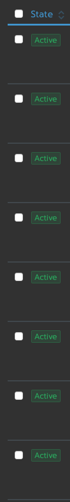
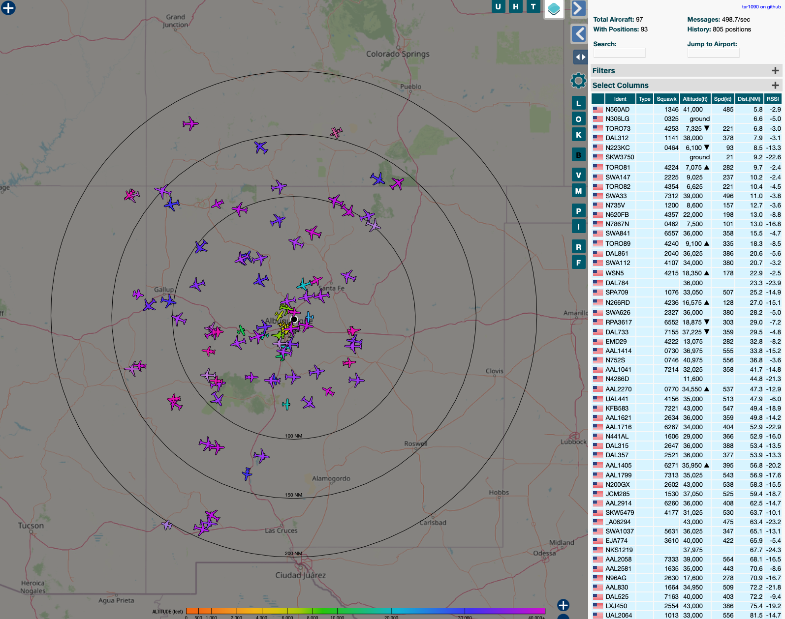

# ansible-adsb
 
This repository hosts [ansible](https://www.ansible.com) playbooks for deploying a full ADSB re-streaming site to various ADSB websites in to a [rancher](https://rancher.com) kubernetes cluster. Most of the focus is on deploying the workloads, however, there are included roles and playbooks for starting up the server nodes from scratch, deploying rancher, as well as a few useful and or fun workloads to deploy that aren't ADSB related.

The primary goal of these playbooks is to make it as easy as possible for you to take any number of computers, put them in to a cluster, and with the minimal thought have a working cluster that is feeding your ADSB data.

A special thank you to [mikenye](https://github.com/mikenye) for his fantastic ADSB docker images. Without them this project would not have even been possible. Additionally, a special thank you to [geerlingguy](https://github.com/geerlingguy) for his excellent [ansible for devops](https://github.com/geerlingguy/ansible-for-devops) youtube series and [turing pi](https://github.com/geerlingguy/turing-pi-cluster) series, from which I drew major inspiration to even try this.

Tested and working on:

* `aarch64` (`arm64v8`) platform (Raspberry Pi 4) running ubuntu arm64 OS 20.04 LTS

Should work on:

* `x86_64` (`amd64`) platform running non-apt based systems, but will require modification to the playbooks.
* `armv7l` (`arm32v7`) platform (Raspberry Pi 3B+) running 32 bit raspian or ubuntu 32 bit arm os (NOT with rancher!)
* `armv7l` (`arm32v7`) platform (Raspberry Pi 3B+) running 64 bit raspian or ubuntu 64 bit arm os (NOT with rancher!)


If you are installing this on to an ARM based cluster and you do not have 64 bit OS installed you won't be able to use this guide's Cluster Setup and playbooks. Rancher requires ARM64; however, all of the cluster workloads should run on ARM32.


* [fredclausen/ansible-adsb](#ansible-adsb)
  * [Table of Contents](#table-of-contents)
  * [Future expansion of this guide](#future-expansion-of-this-guide)
  * [Workloads](#workloads)
    * [ADSB](#adsb)
    * [Fun or Useful](#fun-or-useful)
  * [Prerequisites](#prerequisites)
    * [Initial server setup](#initial-server-setup)
      * [Installing Ansible](#installing-ansible)
      * [Installing kubectl](#installing-kubectl)
      * [Flashing the OS](#flashing-the-os)
      * [Getting your node IPs](#getting-node-ips)
      * [Update the OS and install packages](#update-the-os-and-install-packages)
  * [Cluster Setup](#cluster-setup)
    * [Configure the new cluster](#configure-the-new-cluster)
    * [Rancher setup](#rancher-setup)
    * [Configure the new cluster](#configure-the-new-cluster)
    * [Provision the new cluster](#provision-the-new-cluster)
    * [Get your kubectl Config](#get-your-kubectl-config)
  * [ADSB Workload Setup](#adsb-workload-setup)
    * [Convenstions used in all.yaml](#conventions-used-in-all-yaml)
    * [MetalLB Setup](#metallb-setup)
    * [Values For All Workloads](#values-for-all-workloads)
    * [RTLSDR Dongle Setup](#rtlsdr-dongle-setup)
    * [readsb-proto Setup](#readsb-proto-setup)
    * [ADSB Hub Setup](#adsb-hub-setup)
    * [ADSB Exchange Setup](#adsb-exchange-setup)
    * [dump978 Setup](#dump978-setup)
    * [FlightRadar24 Setup](#flightradar24-setup)
    * [influxdb Setup](#influxdb-setup)
    * [MLAT Setup](#mlat-setup)
    * [OpenSky Setup](#opensky-setup)
    * [PiAware Setup](#piaware-setup)
    * [Plane Finder Setup](#plane-finder-setup)
    * [tar1090 Setup](#tar1090-setup)
    * [Install the workloads](#install-the-workloads)
  * [Misc](#misc)
    * [Changing a Workload Config](#changing-a-workload-config)
    * [Updating the Workloads](#updating-the-workloads)
    * [Deleting Workloads](#deleting-the-workloads)
    * [Updating the Server](#updating-the-server)
    * [The node I am running readsb/dump978 on died. Now what?](#the-node-i-am-running-readsbdump978-on-died-now-what)
    * [Adding In Extra Nodes to the Cluster](#adding-in-extra-nodes-to-the-cluster)

## Future Expansion Of This Guide

It is my goal to have this repository cover installing these docker images on any number of configurations. As such, I am working on the following cluster install methods:

* Docker with no cluster
* k3s

As well as the following improvements:

* Other aviation related workloads such as audio streaming/listening of air traffic frequecies
* Package installation during server/cluster provisioning agnostic of underlying operating system

I also have no doubt missed some "best practice" stuff when it comes to how these playbooks were designed and how I designed the workloads for the cluster, among other things. If you see any security, optimizations, typos, etc, open an issue we can have a discussion!

## Workloads

Below is a list of workloads that can be deployed in to the cluster. Each workload can be individually turned off if you decide you don't want to install it in to the cluster via the `group_vars/all.yaml` file. This will be discussed further in the [config](#configure-the-new-cluster) section.

### ADSB

| Workload | Type |
| ---------|------|
| [asbdexchange](https://github.com/mikenye/docker-adsbexchange) | Feeder |
| [adsbhub](https://github.com/mikenye/docker-adsbhub) | Feeder |
| [dump978](https://github.com/mikenye/docker-dump978) | RTLSDR Decoder |
| [fr24/flightradar24](https://github.com/mikenye/docker-flightradar24) | Feeder |
| [influxdb](https://hub.docker.com/_/influxdb) | Database |
| [mlat](https://github.com/mikenye/docker-readsb-protobuf) | Local data aggregator |
| [opensky](https://github.com/mikenye/docker-opensky-network) | Feeder |
| [plane finder](https://github.com/mikenye/docker-planefinder) | Feeder |
| [readsb-proto-buf](https://github.com/mikenye/docker-readsb-protobuf) | RTLSDR Decoder / Statistics collection / Statistics Visualization / Map visualization of targets |
| [tar1090](https://github.com/mikenye/docker-tar1090) | Map visualization of targets |

## Fun or Useful

| Workload | Type |
| ---------|------|
| cloudflared | DNS encryption |
| pihole | DNS ad filtering |
| guac | Server management interfaces (SSH, remote desktop, etc) |
| nut | UPS management for cluster notes |
| transmission | torrent client |

## Prerequisites

Download this repository or git clone to your local system to get started.

* Re-name `group_vars/all.template.yaml` to `group_vars/all.yaml`

* You will need a NFS share to save the persistent data of the workloads. If you are familiar with kubernetes storaging and want to change this around, be my guest. However, by providing the playbooks a NFS share it will automatically set up the cluster storage correctly.

* You need to know the serial number of your RTLSDR dongles.

* If you are going to provision the servers using these playbooks, the underlying system has to have apt as the package manager. In the future this requirement will go away.

These playbooks are designed to run against a kubernetes cluster. This cluster could be running k8s, k3s, or Rancher rke. If you don't have a cluster installed, we'll cover how to use this repository's files to set up rancher but keep in mind rancher cannot run on ARM32, and it is basically unusuable on Pi3B+ even if running a 64bit ARM distro due to the limits of the 3B+ hardware. k3s should be your choice if you do not have at a minimum Pi4s with 4gb of RAM for the master node.

If you have a working cluster that can accessed using a local instance of kubectl, as well as ansible installed, head on down to [ADSB Workload Setup](#adsb-workload-setup). If not, read on!

#### Installing Ansible

Head on over to [ansible's documentation](https://docs.ansible.com/ansible/latest/installation_guide/intro_installation.html) to find directions on installing ansible for your system. Note, this needs to be installed on your computer, not on any of the nodes you will be setting up for the cluster!

#### Installing kubectl

Head on over to [kubernete's site](https://kubernetes.io/docs/tasks/tools/install-kubectl/) for directions on installing kubectl for your system. Note, this needs to be installed on your computer, not on any of the nodes you will be setting up for the cluster!

#### Flashing the OS

For ARM based systems that can run ARM64 (Pi3B+ and Pi4) I STRONGLY recommend ARM64 based operating systems such as [ubuntu's ARM64 server](https://ubuntu.com/download/server/arm). 64bit is absolutely required for a Rancher RKE cluster, but in general is a good choice even if you aren't using Rancher RKE.

To flash the image on to an SD card, see the [other tools](https://www.raspberrypi.org/documentation/installation/installing-images/) at that link for guidance. Balena Etcher is great and very easy.

For other architectures follow the install guide for your distribution of linux. Server distros are strongly recommended.

#### Getting the Node IPs

Now its time to start some configuration. Plug in your Pi's SD cards and power, power on your VMs, or otherwise turn on your nodes and ensure they are connected to your network.

We need to know the IPs of the nodes. Google around if you need help, but generally, you can look in your router's web interface for the most basic way of getting the IPs of all of the nodes.

Please, ensure at a bare minimum the node you intend to be the `master node` has a static IP assigned. I recommend all of the nodes have static IPs but it isn't strictly speaking necessary.

Now we need to configure the `inventory/inventory` file.

There are four sections here.

* `[master]` is the section that will tell ansible what node(s) will be the master node(s). Please input the IP address of the node(s). The playbooks you will run will set the host name of each of the nodes via the `new_hostname` variable on the same line as the IP address of the node. You can see the format I've used, and while it is not requisite to change the default value I have provided, you can. The name just has to be unique for each node on the cluster. With rancher you can have multiple master nodes; if you are not running Rancher I'd suggest having a single master node unless you are familiar with configuring your cluster to work with multiple masters.

* `[workers]` is the exact same formatting as master above, except that these are the nodes you intend to run as the worker(s).

* `[rancher]` is the node that the rancher management interface will be installed on. It should be a master node, and only one of the master nodes if you have more than one.

* `[nut-master]` and `[nut-slave]` are a list of all of the nodes you want to run the nut UPS management stuff on. Set the IP address of the node that has the UPS plugged in to it under `[nut-master]`, and all of the nodes you intend to monitor the UPS under `[nut-slave]`.

* If you do not have a UPS, or do not wish to configure it, delete all of the IPs under both headers.

The config files will be copied to the server when we set up the nodes. Modify the nut config files for the nut-server and nut-slave under roles/nut-(master/slave)/files to suit your configuration.


#### Update the OS and Install Packages

Now it is time to prepare the system for the cluster, and we will do that by updating it, ensuring the hardware configuration for docker is correct, actually installing docker, and finally, installing rancher. 

Open a terminal window and `cd` in to the directory containing the repository.

Issue the following command

```
ansible-playbook -i inventory/inventory setup-servers.yaml
```

And sit back and wait. Depending on the age of the operating system you installed and the performance of the nodes, this may take a while. Your system will reboot to apply the host-name change and any kernel-updates.

### Configure The New Cluster

## Cluster Setup

At this point, you should have your nodes all prepared. Let us configure the cluster.

## Configure the New Cluster

Open your web browser and open it up to `https://your rancher ip you set above:8443`. Go through the initial setup which should all be self explanatory. Default username and password are both `admin`.

The first thing we need to do is set up a new cluster. 

* Click `Add Cluster`. If you do not see an `Add Cluster` button at the top right, click global at the very top of the screen. On the next screen, click `Existing Nodes`

We need to change a few configuration options here. 

* Give your cluster a name under `Cluster Name`.

* Under `Kubenetes Options` change `Network Provider` to `Flannel`. You might be fine to use other options, but with a Pi4 based cluster I found `Flannel` to be the only one that appeared to work.

* Under `Advanced Options` change `Nginx Ingress` to `Disabled`. We are doing this because we will be using metallb as the load balancer to provide the ingress in to the cluster and assign IPs to the cluster workloads.

* Click `Next`

On the next screen we have some values we need to save to `group_vars/all.yaml`.

* Copy the value after `--token` to the `rancher_token` variable.

* Copy the value after `--ca-checksum` to the `rancher_checksum` variable.

* Copy the value after `--server` to the `rancher_server` variable.

* Save all.yaml.

### Provision the New Cluster

Return to your terminal window and execute the following command

```
ansible-playbook -i inventory/inventory setup-pods-master.yaml
```

And brew yourself a nice coffee. This will take a very long time. You may see some nodes show an error; that is fine, let the process take its course and they will go away. What you are waiting to see in the Rancher management interface your cluster get fully provisioned. You can watch this by clicking `Nodes` at the top of the screen and waiting for your screen to not show any errors and the nodes to show active. It will look something like this.



### Get your kubectl Config

We need to get the kubectl config file so we can issue commands to the cluster from your computer. 

* Head to your rancher web interface and click `Cluster` at the top. 

* You should see a button on the top right that says `Kubeconfig file`. Click that.

* Save the text that comes up to  `~/.kube/config` on Mac or Linux systems. See [this site](https://forum.wise-paas.advantech.com/-12/faq-how-to-set-up-kubeconfig-on-windows) for information on what to do for windows systems.

* Lastly, to test that this all works issue the following command in your terminal window

```
kubectl get pods
```

If you get no errors, congratulations, you have a cluster and can issue commands to it! Let's get to the fun stuff.

## ADSB Workload Setup

Before we go on to setting everything up, it is time to have a think about what workloads you want to deploy. At a bare minimum you will need readsb-proto. It isn't required to set up anything else; with that said, feeding the various ADSB websites is pretty cool and some even give you some minor perks for doing so, so why not? We'll go over configuring each workload below.

I have provided a IPs.txt file that includes the default IPs set for each workload. As you go through the configuration below, I suggest listing the IPs in that file for each workload so that you have a list of them all in one place.

### Conventions Used In all.yaml

* In this section if you are told to change a variable, the variable is located in `group_vars/all.yaml`.

* Variables are used to configure the workloads to suit your setup. I have provided sane defaults that should require minimal configuration. If you need more advanced configuration than the variables provided give (not every enviornment variable is set, for instance) look at the `roles/workloadname/tasks/main.yaml` file.

* Variables for a workload start with the name of the workload followed by an underscore

* To enable the installation of a workload, ensure `workload_install` is set to  `true`

* The layout may appear messy (and I would LOVE feedback on how to make it better), but there is a method to the madness I chose. I have gloabl/server configuration at the top, followed by global values that apply to all workloads, followed by IPs for the workloads, followed by port mapping, credentials for the workloads, and finally, the workload configurations. The idea with splitting up the sections this way is each section might reference variable names from the previous section to configure certain items, and I wanted a value to be set once (such as the IP address or port mapping for a workload) and any workload that needs to know about that IP address or port mapping can just use the variable name.

* All of the workloads in the default all.yaml config have the default ports set in the variables; the only exception is if any workload has a web interface that is not on port 80. If the web interface is default to a non port 80 port, I have mapped those back to port 80. This configuration works as long as each workload gets a unique IP. There is no reason I can see that you will have to change these ports, but they are configurable.

### MetalLB Setup

We are using MetalLB to provide the ingress controller to the cluster, so we need to adjust one simple setting to make it work.

* Update the `metallb_config` variable to the correct IP range for your network. You will need a range of roughly 15 IP addresses to give yourself breathing room.
* Update your router's DHCP IP range to exclude those IP addresses so they do not get handed out to any clients.

### Values For All Workloads

Please refer to the table below and set the values to match your installation needs. Unless noted, all of these values need to be set, as they apply to all or most workloads.

|Variable Name | Description | Notes |
| ------------ | ----------- | ----- |
| `nfs_share_ip` | The NFS share ip address | The value is used in all workloads that have a need for persistent data retention |
| `nfs_share_path` | The path on the NFS to the share | The value is used in all workloads that have a need for persistent data retention |
| `timezone | Timezone for the workloads | ["TZ database name" format](<https://en.wikipedia.org/wiki/List_of_tz_database_time_zones>). Use a `\\` in place of a single `\`|
| `lat` | Latitude of the site | Decimal format |
| `lon` | Longitude of the site | Decimal format |
| `alt_with_units` | Altitude of the site | In feet, no units |
| `alt_without_units` | Altitude of the site | In feet or meters, with "ft" or "m" respectively |
| `alt_meters` | Altitude of the site | In meters, no units |

### RTLSDR Dongle Setup

If you haven't already, time to plug in your RTLSDR dongles to whatever node(s) you feel like, taking care to note which node you did plug the RTLSDR in to. If you have both a 1090mhz and a 978mhz dongle it is possible to plug both dongles in to the same node, but they MUST have different serial numbers. See [this post](https://discussions.flightaware.com/t/how-to-serialize-dongles-for-es1090-uat978/48147) for changing the serial number of the device, ignoring step 1.1 because I have already installed rtl-sdr on to the nodes. 

If they are the same serial number (default `00000000`) that is fine, but they MUST be plugged in to different nodes.

* Update the the variables for the RTLSDR configuration.
    - 1090mhz dongle
        + change `readsb_serial` to the serial number of the dongle.
        + change `adsb_host` to the IP address of the node you have the dongle plugged in to.
        + change `readsb_node` to the host name of the node you have the dongle plugged in to.
    - 978mhz dongle if present
        + change `readsb_serial` to the serial number of the dongle
        + change `uat_host` to the host name of the node you have the dongle plugged in to.
        + change `dump1090_node` to the IP address of the node you have the dongle plugged in to.

### readsb-proto Setup

This workload is the meat and potatoes of the entire ADSB installation. It will provide map visualization of the targets seen (including, if set up MLAT and 978), statistics, as well as the feed that other containers can read from to feed out to various services.

Please refer to the table below and set the values to match your installation needs.

|Variable Name | Description | Notes |
| ------------ | ----------- | ----- |
| `readsb_install`  | Set to true to enable install, any other value to disable the install | None | 
| `readsb_image`  | Set the docker image used | [mikenye](https://github.com/mikenye) is constantly adding in new features and sometimes won't have the features on the `:latest` image |
| `readsb_device_type`  | Sets the radio device type | See [readsb general options](https://github.com/mikenye/docker-readsb-protobuf#readsb-general-options) for valid options. You probably want rtlsdr |
| `readsb_serial`  | Serial number of the RTLSDR device | None |
| `readsb_net_connector`  | Used to set the other container images providing MLAT or dump978 data | See [readsb network options](https://github.com/mikenye/docker-readsb-protobuf#readsb-network-options) for config options. If you aren't running either MLAT or dump978, remove all text between the quotes. If you are only using MLAT or dump978, remove the unused option |
| `adsb_host`    | The IP address of the workload | This value not only sets the `readsb-protobuf` IP, it is used across many workloads so that they can connect and receive ADSB data |
| `readsb_web_port` | The port used to access the `readsb-protobuf` web interface | None |
|`readsb_rawin_port` | The port used to receive ADSB raw data | None |
| `readsb_rawout_port` | The port used to expose ADSB raw data | None |
| `readsb_sbs_port` | The port used to expose ADSB Base Station Data | None |
| `readsb_sbs_text_port` | Same as above, but it is set between quotes | Ensure both `sbs` variables are the same number. This is done because of kubernetes/ansible formatting requirements |
| `readsb_beastin_port` | The port used to receive ADSB Beast formatted data | None |
| `readsb_beastout_port` | The port used to expose ADSB Beast formatted data | None |
| `readsb_beastout_text_port` | Same as above, but it is set between quotes | Ensure both `beastout` variables are the same number. This is done because of kubernetes/ansible formatting requirements |
| `readsb_beastin_other_port` | An alternative port for ADSB Beast formatted data | None |
| `readsb_influxsb_url` | If you intend to write ADSB data to influx db, leave this value set. If you won't be using influx db, remove the text between the quotes | See [InfluxDB setup](#influxdb-setup) |

This workload has a web interface that can be accessed at `adsb_host:readsb_web_port`

### ADSB Hub Setup

This workload feeds data to [ADSB Hub](https://www.adsbhub.org).

|Variable Name | Description | Notes |
| ------------ | ----------- | ----- |
| `adsbhub_install`  | Set to true to enable install, any other value to disable the install | None | 
| `adsbhub_image`  | Set the docker image used | [mikenye](https://github.com/mikenye) is constantly adding in new features and sometimes won't have the features on the `:latest` image |
| `adsbhub_clientkey`  | The client key to identify your site | See [adsbhub](https://github.com/mikenye/docker-adsbhub) for ADSB Hub web setup instructions if this is your first time running ADSB Hub |

### ADSB Exchange Setup


This workload feeds data to [ADSB Exchange](https://www.adsbexchange.com) as well as MLAT data if desired.

|Variable Name | Description | Notes |
| ------------ | ----------- | ----- |
| `adsbexchange_install`  | Set to true to enable install, any other value to disable the install | None | 
| `adsbexchange_image`  | Set the docker image used | [mikenye](https://github.com/mikenye) is constantly adding in new features and sometimes won't have the features on the `:latest` image |
| `adsbexchange_uuid`  | The UUID provided by ADSB Exchange to identify your site | See [asbdexchange](https://github.com/mikenye/docker-adsbexchange) for setup instructions to get the UUID if you don't already have one |
| `adsbexchange_site_name`  | Your site name | None |
| `adsbexchange_mlat_port` | The port to expose MLAT data | None |
| `adsbexchange_ip` | Set the IP of the workload | None |

### dump978 Setup

This workload provides 978mhz UAT/ADS-R radar to readsb-protobuf and piaware. 

|Variable Name | Description | Notes |
| ------------ | ----------- | ----- |
| `dump978_install`  | Set to true to enable install, any other value to disable the install | Most installs will want this workload disabled | 
| `dump978_image`  | Set the docker image used | [mikenye](https://github.com/mikenye) is constantly adding in new features and sometimes won't have the features on the `:latest` image |
| `dump978_serial`  | Serial number of the RTLSDR device | None |
| `dump978_rawuat_port`  | Port to expose raw UAT data | For now, leave as default |
| `dump978_json_port`  | Port to expose UAT data as JSON | None |
| `dump978_rawout_port`  | Port to expose raw UAT data | For now, leave as default |
| `uat_host` | Set the IP of the workload | None |

### FlightRadar24 Setup

This workload feeds data to [FlightRadar24](https://www.flightradar24.com).

|Variable Name | Description | Notes |
| ------------ | ----------- | ----- |
| `fr24_install`  | Set to true to enable install, any other value to disable the install | None | 
| `fr24_image`  | Set the docker image used | [mikenye](https://github.com/mikenye) is constantly adding in new features and sometimes won't have the features on the `:latest` image |
| `fr24_mlat_enable`  | Enable MLAT with FR24 service | None |
| `fr24_key`  | The site key from FR24 for your site | See [flightradar24](https://github.com/mikenye/docker-flightradar24) for setup instructions |
| `fr24_web_port`  | Web interface for the workload | None |
| `fr24_base_port`  | Port to expose SBS formatted data | None |
| `fr24_raw_port`  | Port to expose raw ADSB data | None |
| `fr24_ip` | Set the IP of the workload | None |

This workload has a web interface that can be accessed at `fr24_ip:fr24_web_port`

### influxdb Setup

The workload provides an influxdb instance that readsb-protobuf can write ADSB data to. This workload is very much optional.

|Variable Name | Description | Notes |
| ------------ | ----------- | ----- |
| `influxdb_install`  | Set to true to enable install, any other value to disable the install | Most installs will want this workload disabled | 
| `influxdb_image`  | Set the docker image used | None |
| `influxdb_ip` | Set the IP of the workload | None |

### MLAT Setup

The workload provides an aggregator of MLAT data that readsb can read from and show the map visualization.

|Variable Name | Description | Notes |
| ------------ | ----------- | ----- |
| `mlat_install`  | Set to true to enable install, any other value to disable the install | None | 
| `readsb_image`  | Set the docker image used. This is the readsb-protobuf container, configured to operate only as an MLAT host | None |
| `mlat_host` | Set the IP of the workload | None |
| `mlat_out_port` | Port to expost the aggregated MLAT data | None |
| `mlat_out_port_text` | Same as above, but it is set between quotes | Ensure both `out_port` variables are the same number. This is done because of kubernetes/ansible formatting requirements |
| `mlat_net_connector` | Used to tell the workload what containers provide MLAT data | See [readsb network options](https://github.com/mikenye/docker-readsb-protobuf#readsb-network-options) for formatting. Currently, PiAware and ADSB Exchange provide MLAT data |

### OpenSky Setup

This workload feeds data to [Opensky](https://opensky-network.org).

|Variable Name | Description | Notes |
| ------------ | ----------- | ----- |
| `opensky_install`  | Set to true to enable install, any other value to disable the install | None | 
| `opensky_image`  | Set the docker image used | [mikenye](https://github.com/mikenye) is constantly adding in new features and sometimes won't have the features on the `:latest` image |
| `opensky_serial`  | The serial Opensky has assigned to your site | See [opensky](https://github.com/mikenye/docker-opensky-network) for setup instructions |
| `opensky_username`  | Your opensky user name | See [opensky](https://github.com/mikenye/docker-opensky-network) for setup instructions |


### piaware Setup

This workload feeds data to [Flight Aware](https://flightaware.com).

|Variable Name | Description | Notes |
| ------------ | ----------- | ----- |
| `piaware_install`  | Set to true to enable install, any other value to disable the install | None | 
| `piaware_image`  | Set the docker image used | [mikenye](https://github.com/mikenye) is constantly adding in new features and sometimes won't have the features on the `:latest` image |
| `piaware_feeder_id`  | The serial PiAware has assigned to your site | See [PiAware](https://github.com/mikenye/docker-piaware) for setup instructions |
| `piaware_web_port`  | Port to expose the web interface | None |
| `piaware_basestation_port`  | Port to expose the Base Station ADSB data | None |
| `piaware_beastout_port`  |  Port to expose Beast out ADSB data | None |
| `piaware_mlat_port`  | Port to expose MLAT data | Used by the MLAT container |
| `piaware_uatraw_port`  | Port to expose UAT raw data | None |
| `piaware_uatjson_port`  | Port to expose UAT JSON data | None |
| `piaware_ip`  | Set the IP of the workload | None |

This workload exposes a web interface at `piaware_ip:piaware_web_port`

### Plane Finder Setup

This workload feeds data to [Plane Finder](https://planefinder.net).

|Variable Name | Description | Notes |
| ------------ | ----------- | ----- |
| `planefinder_install`  | Set to true to enable install, any other value to disable the install | None | 
| `planefinder_image`  | Set the docker image used | [mikenye](https://github.com/mikenye) is constantly adding in new features and sometimes won't have the features on the `:latest` image |
| `planefinder_sharecode`  | The share code Plane Finder has assigned to your site | See [plane finder](https://github.com/mikenye/docker-planefinder) for setup instructions |
| `planefinder_web_port`  | Port to expose the web interface | None |
| `planefinder_echo_port`  | Unused at the moment | None |
| `planefinder_ip`  | Set the IP of the workload | None |

This workload exposes a web interface at `planefinder_ip:planefinder_web_port`

### tar1090 Setup

This workload provides an impoved map visualization of the ADSB data from readsb, as well as heat maps to show coverage area.

|Variable Name | Description | Notes |
| ------------ | ----------- | ----- |
| `tar1090_install`  | Set to true to enable install, any other value to disable the install | None | 
| `tar1090_image`  | Set the docker image used | [mikenye](https://github.com/mikenye) is constantly adding in new features and sometimes won't have the features on the `:latest` image |
| `tar1090_web_port`  | Port to expose to web interface | None |
| `tar1090_ip`  | Set the IP of the workload | None |

This workload exposes a web interface at `tar1090_ip:tar1090_web_port`

### Install the Workloads

We have one more setting to take a look at. Most likely, unless you want to set up the Misc workloads (not covered in this guide...if you've made it this far and end up with ADSB stuff working the "Fun" stuff should be easy!), ensure `install_misc_services` is set to false and `install_adsb_services` is set to true.

And now, let us install the workloads. Issue the following command in your terminal.

```
ansible-playbook -i inventory/inventory setup-cluster-services.yaml
```

And sit back. It should not take too much time to run through the play book, and we you are done, look at the workload logs in Rancher, paying attention to making sure none of the workloads are in an unstarted state (generally related to architecture issues of the docker image; I've done my best to mitigate that) and that readsb and the feeders have connected to their services with no issues.

If something didn't deploy right or you received some kind of error from ansible, don't fret! The errors from ansible are generally pretty easy to figure out what was not configured right, and easy to change it. Once you've done that, just rerun the command above. Don't worry, you can run that command a million times if you want; only if a config changes or the workload is not deployed will anything actually change on the cluster.

And that really is it. I'll cover below some extra stuff related to the cluster, such as maintence and removing workloads, but you are all done for now!

Happy ADSB-ing!



## Misc

In this section we will cover using the provided playbooks to manage the cluster and nodes.

### Changing a Workload Config

It is as easy as updating the variables in `all.yaml` to suit your new config and running 

```
ansible-playbook -i inventory/inventory setup-cluster-services.yaml
```

Again. Don't worry, you can run that command a million times if you want; only if a config changes or the workload is not deployed will anything actually change on the cluster.

### Updating the workloads

Unfortunately, kubernetes does not have an easy way to force pods to re-deploy if the underlying docker image has changed.

You have the following options to force a redeployment:

* In the all.yaml file, instead of using `latest` or no tag, tag a specific release. When you know the image updated, change the release tag in the image name and rerun `ansible-playbook -i inventory/inventory setup-cluster-services.yaml`. This will cause any images that changed to get redeployed with the updated image. With the base images for most of the ADSB containers this isn't a really viable solution.

* In the rancher interface, workload pane, click the checkmark by any workload you want to update and hit `Redeploy`. This will cause the images to get pulled again.

### Deleting workloads

* Workloads can be deleted easily from the rancher interface via the Workloads page. If you do this and want the workload to not in the cluster again, make sure to change the `workload_install` option to false.

* You can remove ALL workloads from the cluster as well. Ensure that `workload_install` is set to true for any workload that is currently running on the cluster, and the run the following command

```
ansible-playbook -i inventory/inventory remove-cluster-services.yaml
```

* Alternatively, if you want to use ansible but only want to remove a small number of workloads, look at teh test.template.yaml file (I suggest renaming it test.yaml) and under the `[Roles]` section, add in any workloads you want to delete (using the name of the folder found under `roles/name-of-workload`) and then run the following command

```
ansible-playbook -i inventory/inventory test.yaml --extra-vars "workload_state=absent"
```

### Updating the server

Once in a while you will want to ensure the operating system of the nodes is up to date. The provided playbook will make sure the required packages are all installed, update the cache of packages from the up-stream package repositories and lastly update the packages. In order to minimize down time of any part of the cluster, this playbook will run on one node at a time. If a kernel update is detected the node will be rebooted.

Issue the following command in a terminal window to update the server.

```
ansible-playbook -i inventory/inventory update-installed-packages.yaml
```

### The Node I am Running readsb/dump978 On Died. Now what?

One limiting factor we have in our cluster is that the dongles for the RTLSDR (or whatever hardware device you are using to provide the ADSB data) can be plugged in to only one node. If that node dies for any reason (I mean, Micro SD cards are relatively frail for storage) we lose ADSB data and none of the feeders can do their job, map visualizations are gone, and your performance charts will look sad. Obviously, we want to quickly be able to recover from that, which we can.

One note, I am going to address readsb in this section, but this also applies to dump978 as well. Just replace `readsb` with `dump978` and carry on.

The first step is going to be to remove the node tag for readsb. What is happening under the hood is the readsb-protobuf workload can only be run on a node if it is tagged with `readsb=usb`, so we need to tell the cluster what node to run on by changing the tag.

```
ansible-playbook -i inventory/inventory remove-usb-tags.yaml
```

Now update `readsb_node` with the new node and save `all.yaml`.

Issue the following command:

```
ansible-playbook -i inventory/inventory set-new-usb-tags.yaml
```

And your readsb workload should come back up on the new node.

### Adding In Extra Nodes to the Cluster

So, you like your cluster but want more....clustery goodness? I'm with you.

Adding nodes is super easy! After your OS is installed and ready to provision, create a temporary inventory file with either `[master]` or `[worker]` section in it, and follow the formatting convention in the main inventory file as discussed in [Getting your node IPs](#getting-node-ips) with the new IP address(es) of the new nodes.

Issue the following commands to provision the new node:

```
ansible-playbook -i path-to-temp-inventory-file setup-servers.yaml
ansible-playbook -i path-to-temp-inventory-file setup-pods-master.yaml
```

And you should be good. Enjoy your extra clusteryness.